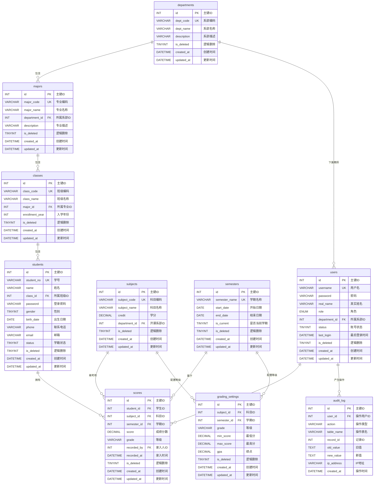

# 学生成绩在线发布系统 - 数据库 ER 图文档

> 文档版本：v1.0  
> 适用项目：基于 JSP + Servlet + JDBC + MySQL 的学生成绩在线发布系统  
> 设计原则：第三范式（3NF）、逻辑删除、自动时间戳、完整外键约束

---

## 一、ER 图（Mermaid 语法）



---

## 二、数据库表结构详细说明

### 1. departments（系部表）

**业务用途**：存储学校所有系部的基本信息，是组织架构的最顶层。解决"学生、教师、科目分别属于哪个系部"的问题，为按系部统计成绩提供数据基础。

**使用场景**：
- 需求 2（学生查询）：学生查看成绩时显示所属系部
- 需求 5（信息统计）：按系部汇总成绩分布、不及格人数等
- 需求 6（信息打印）：按系部分类打印成绩

| 字段名 | 类型 | 约束 | 业务含义 | 使用场景说明 |
|--------|------|------|----------|--------------|
| id | INT | PRIMARY KEY, AUTO_INCREMENT | 主键ID | 系统内部唯一标识每个系部，所有关联表通过此字段引用系部 |
| dept_code | VARCHAR(20) | NOT NULL, UNIQUE | 系部编码 | 如"CS"表示计算机系，管理员在系统设置时录入，教师按系部分配权限时使用 |
| dept_name | VARCHAR(100) | NOT NULL | 系部名称 | 如"计算机科学与技术系"，在成绩统计报表、打印页面展示给用户看 |
| description | VARCHAR(255) | NULL | 系部描述 | 补充说明系部的研究方向或特色，在系统设置页面展示 |
| is_deleted | TINYINT | DEFAULT 0, CHECK (is_deleted IN (0,1)) | 逻辑删除标记 | 0=正常，1=已删除。管理员删除系部时标记为1，避免级联物理删除导致历史成绩数据丢失 |
| created_at | DATETIME | DEFAULT CURRENT_TIMESTAMP | 创建时间 | 记录系部信息何时录入系统，管理员在系统设置中查看系部创建历史 |
| updated_at | DATETIME | DEFAULT CURRENT_TIMESTAMP ON UPDATE CURRENT_TIMESTAMP | 更新时间 | 记录系部信息最后修改时间，用于数据同步和审计追踪 |

**与其他表的关系**：
- 外键关联：无（系部表是顶层表，不依赖其他表）
- 被哪些表关联：
  - `majors.department_id` → `departments.id`（N:1，一个系部包含多个专业）
  - `subjects.department_id` → `departments.id`（N:1，一个系部开设多门科目）
  - `users.department_id` → `departments.id`（N:1，一个系部有多名教师/管理员）

**索引建议**：
- `dept_code`：唯一索引，系部编码是高频查询条件，在教师权限验证、按系部筛选时经常使用
- `is_deleted`：普通索引，与dept_code组成联合查询条件，过滤已删除数据

**业务约束说明**：
- 联合唯一约束：`dept_code` + `is_deleted` 联合唯一，确保同一编码只能有一个有效系部，但允许删除后重新创建同名系部
- 检查约束：`is_deleted` 只能为0或1，防止非法值
- 逻辑删除：通过 `is_deleted` 字段实现，删除系部时标记为1，关联的专业、班级、学生仍保留历史数据

---

### 2. majors（专业表）

**业务用途**：存储各系部下属的专业信息，是系部与班级之间的中间层级。解决"某个专业属于哪个系部"的问题，支持按专业维度统计成绩。

**使用场景**：
- 需求 5（信息统计）：按专业分类汇总成绩，如"计算机专业平均分"
- 需求 6（信息打印）：按专业打印成绩汇总表

| 字段名 | 类型 | 约束 | 业务含义 | 使用场景说明 |
|--------|------|------|----------|--------------|
| id | INT | PRIMARY KEY, AUTO_INCREMENT | 主键ID | 系统内部唯一标识每个专业 |
| major_code | VARCHAR(20) | NOT NULL, UNIQUE | 专业编码 | 如"CSSE"表示软件工程，管理员在系统设置中录入，用于快速定位专业 |
| major_name | VARCHAR(100) | NOT NULL | 专业名称 | 如"软件工程"，在成绩查询、统计报表中展示 |
| department_id | INT | NOT NULL, FOREIGN KEY → departments(id) | 所属系部ID | 关联系部表，标识该专业归属哪个系部。教师只能查看自己系部下属专业的成绩 |
| description | VARCHAR(255) | NULL | 专业描述 | 补充说明专业培养方向，在系统设置页面展示 |
| is_deleted | TINYINT | DEFAULT 0, CHECK (is_deleted IN (0,1)) | 逻辑删除标记 | 0=正常，1=已删除。删除专业时保留历史班级和学生数据 |
| created_at | DATETIME | DEFAULT CURRENT_TIMESTAMP | 创建时间 | 记录专业信息何时录入 |
| updated_at | DATETIME | DEFAULT CURRENT_TIMESTAMP ON UPDATE CURRENT_TIMESTAMP | 更新时间 | 记录专业信息最后修改时间 |

**与其他表的关系**：
- 外键关联：`department_id` → `departments.id`（N:1，多个专业属于一个系部）
- 被哪些表关联：
  - `classes.major_id` → `majors.id`（1:N，一个专业包含多个班级）

**索引建议**：
- `department_id`：普通索引，按系部查询专业列表时使用
- `major_code`：唯一索引，专业编码是高频查询条件
- `is_deleted`：普通索引，过滤已删除数据

**业务约束说明**：
- 联合唯一约束：`major_code` + `is_deleted` 联合唯一
- 外键约束：删除系部时，级联限制（RESTRICT），避免误删有下属专业的系部
- 逻辑删除：通过 `is_deleted` 字段实现

---

### 3. classes（班级表）

**业务用途**：存储各专业下属的班级信息，是学生归属的基本单位。解决"某个学生属于哪个班级"的问题，支持按班级维度统计和打印成绩。

**使用场景**：
- 需求 2（学生查询）：学生查看成绩时显示所属班级
- 需求 5（信息统计）：按班级汇总成绩，如"软件工程1班平均分"
- 需求 6（信息打印）：按班级打印成绩单

| 字段名 | 类型 | 约束 | 业务含义 | 使用场景说明 |
|--------|------|------|----------|--------------|
| id | INT | PRIMARY KEY, AUTO_INCREMENT | 主键ID | 系统内部唯一标识每个班级 |
| class_code | VARCHAR(20) | NOT NULL, UNIQUE | 班级编码 | 如"CSSE202301"，编码规则：专业编码+入学年份+序号，方便快速识别班级 |
| class_name | VARCHAR(100) | NOT NULL | 班级名称 | 如"软件工程2023级1班"，在成绩查询、统计报表中展示 |
| major_id | INT | NOT NULL, FOREIGN KEY → majors(id) | 所属专业ID | 关联专业表，标识该班级归属哪个专业。按专业统计时需要此字段关联 |
| enrollment_year | INT | NOT NULL, CHECK (enrollment_year BETWEEN 2000 AND 2100) | 入学年份 | 如2023，用于区分同专业不同年级的班级，在按年级统计时使用 |
| is_deleted | TINYINT | DEFAULT 0, CHECK (is_deleted IN (0,1)) | 逻辑删除标记 | 0=正常，1=已删除。删除班级时保留历史学生数据 |
| created_at | DATETIME | DEFAULT CURRENT_TIMESTAMP | 创建时间 | 记录班级信息何时录入 |
| updated_at | DATETIME | DEFAULT CURRENT_TIMESTAMP ON UPDATE CURRENT_TIMESTAMP | 更新时间 | 记录班级信息最后修改时间 |

**与其他表的关系**：
- 外键关联：`major_id` → `majors.id`（N:1，多个班级属于一个专业）
- 被哪些表关联：
  - `students.class_id` → `classes.id`（1:N，一个班级包含多名学生）

**索引建议**：
- `major_id`：普通索引，按专业查询班级列表时使用
- `enrollment_year`：普通索引，按入学年份筛选班级时使用
- `class_code`：唯一索引，班级编码是高频查询条件
- `is_deleted`：普通索引，过滤已删除数据

**业务约束说明**：
- 联合唯一约束：`class_code` + `is_deleted` 联合唯一
- 检查约束：`enrollment_year` 限制在2000-2100之间，防止录入错误年份
- 外键约束：删除专业时，级联限制（RESTRICT），避免误删有下属班级的专业
- 逻辑删除：通过 `is_deleted` 字段实现

---

### 4. semesters（学期表）

**业务用途**：存储学校的学期信息，是成绩数据的时间维度标识。解决"成绩属于哪个学期"的问题，支持按学期查询、统计和归档。

**使用场景**：
- 需求 2（学生查询）：学生按学期筛选自己的成绩
- 需求 5（信息统计）：按学期统计成绩分布
- 需求 1（系统设置）：管理员设置当前学期、维护学期列表

| 字段名 | 类型 | 约束 | 业务含义 | 使用场景说明 |
|--------|------|------|----------|--------------|
| id | INT | PRIMARY KEY, AUTO_INCREMENT | 主键ID | 系统内部唯一标识每个学期 |
| semester_name | VARCHAR(50) | NOT NULL, UNIQUE | 学期名称 | 如"2023-2024学年第一学期"，在成绩查询、统计时作为筛选条件展示 |
| start_date | DATE | NOT NULL | 开始日期 | 学期第一天，用于判断成绩录入时间是否合法（不能在学期开始前录入成绩） |
| end_date | DATE | NOT NULL | 结束日期 | 学期最后一天，用于成绩归档和学期结束后的统计分析 |
| is_current | TINYINT | DEFAULT 0, CHECK (is_current IN (0,1)) | 是否当前学期 | 1=当前学期，0=非当前。学生登录后默认查看当前学期成绩，教师默认向当前学期录入成绩 |
| is_deleted | TINYINT | DEFAULT 0, CHECK (is_deleted IN (0,1)) | 逻辑删除标记 | 0=正常，1=已删除。学期数据通常不删除，仅用于标记异常数据 |
| created_at | DATETIME | DEFAULT CURRENT_TIMESTAMP | 创建时间 | 记录学期信息何时录入 |
| updated_at | DATETIME | DEFAULT CURRENT_TIMESTAMP ON UPDATE CURRENT_TIMESTAMP | 更新时间 | 记录学期信息最后修改时间 |

**与其他表的关系**：
- 外键关联：无（学期表是独立的时间维度表）
- 被哪些表关联：
  - `scores.semester_id` → `semesters.id`（N:1，多条成绩记录属于一个学期）
  - `grading_settings.semester_id` → `semesters.id`（N:1，一个学期可有多条等级分值配置）

**索引建议**：
- `semester_name`：唯一索引，学期名称是高频查询条件
- `is_current`：普通索引，快速定位当前学期，每次登录和成绩录入时都会用到
- `start_date` + `end_date`：联合索引，按时间段查询学期时使用

**业务约束说明**：
- 联合唯一约束：`semester_name` + `is_deleted` 联合唯一
- 检查约束：`is_current` 只能为0或1；`start_date` 必须小于 `end_date`
- 业务规则：同一时间只能有一个 `is_current=1` 的学期（建议应用层控制）
- 逻辑删除：通过 `is_deleted` 字段实现

---

### 5. students（学生表）

**业务用途**：存储学生的基本信息和登录凭证，是学生查询成绩的身份依据。解决"谁可以查询成绩、学生属于哪个班级"的问题。

**使用场景**：
- 需求 2（学生查询）：学生用学号和密码登录后查询自己的成绩
- 需求 5（信息统计）：按班级、专业、系部分类统计学生成绩

| 字段名 | 类型 | 约束 | 业务含义 | 使用场景说明 |
|--------|------|------|----------|--------------|
| id | INT | PRIMARY KEY, AUTO_INCREMENT | 主键ID | 系统内部唯一标识每个学生 |
| student_no | VARCHAR(20) | NOT NULL, UNIQUE | 学号 | 学生的唯一标识，如"2023001001"。学生登录时输入学号，查询成绩时按学号定位学生 |
| name | VARCHAR(50) | NOT NULL | 姓名 | 学生真实姓名，在成绩查询页面、成绩单中展示 |
| class_id | INT | NOT NULL, FOREIGN KEY → classes(id) | 所属班级ID | 关联班级表，确定学生的班级归属。按班级统计成绩时通过此字段关联 |
| password | VARCHAR(255) | NOT NULL | 登录密码 | 存储加密后的密码（建议 bcrypt/MD5+盐），学生登录时验证身份 |
| gender | TINYINT | DEFAULT 0, CHECK (gender IN (0,1,2)) | 性别 | 0=未知，1=男，2=女。在统计信息时可用于性别维度的成绩分析 |
| birth_date | DATE | NULL | 出生日期 | 学生生日，可用于年龄维度的统计，或在个人信息页面展示 |
| phone | VARCHAR(20) | NULL | 联系电话 | 学生手机号，用于找回密码或系统通知 |
| email | VARCHAR(100) | NULL | 邮箱 | 学生邮箱，用于接收成绩通知或找回密码 |
| status | TINYINT | DEFAULT 1, CHECK (status IN (0,1,2,3)) | 学籍状态 | 0=退学，1=在读，2=休学，3=毕业。只有状态为1的学生才能正常查询成绩 |
| is_deleted | TINYINT | DEFAULT 0, CHECK (is_deleted IN (0,1)) | 逻辑删除标记 | 0=正常，1=已删除。学生毕业或退学后标记删除，但保留历史成绩数据 |
| created_at | DATETIME | DEFAULT CURRENT_TIMESTAMP | 创建时间 | 记录学生信息何时录入系统 |
| updated_at | DATETIME | DEFAULT CURRENT_TIMESTAMP ON UPDATE CURRENT_TIMESTAMP | 更新时间 | 记录学生信息最后修改时间 |

**与其他表的关系**：
- 外键关联：`class_id` → `classes.id`（N:1，多名学生属于一个班级）
- 被哪些表关联：
  - `scores.student_id` → `students.id`（1:N，一名学生有多条成绩记录）

**索引建议**：
- `student_no`：唯一索引，学号是最高频的查询条件，登录、查询成绩、统计时都会用到
- `class_id`：普通索引，按班级查询学生列表、统计班级成绩时使用
- `status`：普通索引，筛选在读学生时使用
- `is_deleted`：普通索引，过滤已删除数据

**业务约束说明**：
- 联合唯一约束：`student_no` + `is_deleted` 联合唯一，确保同一学号只有一个有效学生
- 检查约束：`gender` 只能为0/1/2；`status` 只能为0/1/2/3
- 外键约束：删除班级时，级联限制（RESTRICT），避免误删有学生的班级
- 逻辑删除：通过 `is_deleted` 字段实现，学生毕业或退学后标记为1，历史成绩仍可查询

---

### 6. subjects（科目表）

**业务用途**：存储学校开设的所有考试科目信息，是成绩数据的核心维度之一。解决"考了什么科目、科目属于哪个系部、学分是多少"的问题。

**使用场景**：
- 需求 1（系统设置）：管理员添加、修改、删除科目
- 需求 2（学生查询）：学生查看各科目成绩
- 需求 5（信息统计）：按科目统计成绩分布、不及格人数

| 字段名 | 类型 | 约束 | 业务含义 | 使用场景说明 |
|--------|------|------|----------|--------------|
| id | INT | PRIMARY KEY, AUTO_INCREMENT | 主键ID | 系统内部唯一标识每个科目 |
| subject_code | VARCHAR(20) | NOT NULL, UNIQUE | 科目编码 | 如"CS101"，科目的唯一标识，在成绩导入、录入时用于快速定位科目 |
| subject_name | VARCHAR(100) | NOT NULL | 科目名称 | 如"数据结构"，在成绩查询、统计报表中展示 |
| credit | DECIMAL(3,1) | NOT NULL, CHECK (credit > 0 AND credit <= 20) | 学分 | 如3.0，表示该科目的学分值。在计算加权平均分、GPA时使用 |
| department_id | INT | NOT NULL, FOREIGN KEY → departments(id) | 开课系部ID | 关联系部表，标识该科目由哪个系部开设。教师只能录入自己系部开设科目的成绩 |
| is_deleted | TINYINT | DEFAULT 0, CHECK (is_deleted IN (0,1)) | 逻辑删除标记 | 0=正常，1=已删除。科目停开后标记删除，但保留历史成绩数据 |
| created_at | DATETIME | DEFAULT CURRENT_TIMESTAMP | 创建时间 | 记录科目信息何时录入 |
| updated_at | DATETIME | DEFAULT CURRENT_TIMESTAMP ON UPDATE CURRENT_TIMESTAMP | 更新时间 | 记录科目信息最后修改时间 |

**与其他表的关系**：
- 外键关联：`department_id` → `departments.id`（N:1，多个科目属于一个系部）
- 被哪些表关联：
  - `scores.subject_id` → `subjects.id`（1:N，一门科目有多条成绩记录）
  - `grading_settings.subject_id` → `subjects.id`（1:N，一门科目可有多条等级分值配置）

**索引建议**：
- `subject_code`：唯一索引，科目编码是高频查询条件
- `department_id`：普通索引，按系部查询科目列表时使用
- `is_deleted`：普通索引，过滤已删除数据

**业务约束说明**：
- 联合唯一约束：`subject_code` + `is_deleted` 联合唯一
- 检查约束：`credit` 必须大于0且小于等于20，防止录入异常学分
- 外键约束：删除系部时，级联限制（RESTRICT），避免误删有开设科目的系部
- 逻辑删除：通过 `is_deleted` 字段实现

---

### 7. scores（成绩表）—— 核心业务表

**业务用途**：存储所有学生的各科成绩，是系统的核心业务表。解决"某个学生某学期某科目考了多少分"的问题，支撑成绩查询、统计、打印等全部核心功能。

**使用场景**：
- 需求 2（学生查询）：学生查询自己的各科成绩
- 需求 3（成绩录入）：教师录入或导入学生成绩
- 需求 4（信息更新）：教师修改、删除成绩
- 需求 5（信息统计）：按各种维度统计成绩
- 需求 6（信息打印）：打印成绩单

| 字段名 | 类型 | 约束 | 业务含义 | 使用场景说明 |
|--------|------|------|----------|--------------|
| id | INT | PRIMARY KEY, AUTO_INCREMENT | 主键ID | 系统内部唯一标识每条成绩记录 |
| student_id | INT | NOT NULL, FOREIGN KEY → students(id) | 学生ID | 关联学生表，标识该成绩属于哪个学生。学生查询成绩时通过此字段筛选 |
| subject_id | INT | NOT NULL, FOREIGN KEY → subjects(id) | 科目ID | 关联科目表，标识该成绩是哪个科目的。按科目统计时通过此字段关联 |
| semester_id | INT | NOT NULL, FOREIGN KEY → semesters(id) | 学期ID | 关联学期表，标识该成绩属于哪个学期。按学期查询时通过此字段筛选 |
| score | DECIMAL(5,2) | NOT NULL, CHECK (score BETWEEN 0 AND 100) | 成绩分数 | 如85.50，表示学生的考试分数。在成绩查询、排名、统计时直接使用 |
| grade | VARCHAR(5) | NULL | 等级 | 如"A"、"B+"、"优秀"，根据 grading_settings 中的规则自动计算。在成绩单中展示 |
| recorded_by | INT | NOT NULL, FOREIGN KEY → users(id) | 录入人ID | 关联用户表，标识该成绩由哪个教师录入。用于审计追踪和责任追溯 |
| recorded_at | DATETIME | DEFAULT CURRENT_TIMESTAMP | 录入时间 | 记录成绩何时被录入，用于判断成绩是否在有效时间内录入 |
| is_deleted | TINYINT | DEFAULT 0, CHECK (is_deleted IN (0,1)) | 逻辑删除标记 | 0=正常，1=已删除。教师删除成绩时标记为1，保留审计历史 |
| created_at | DATETIME | DEFAULT CURRENT_TIMESTAMP | 创建时间 | 记录成绩记录何时创建 |
| updated_at | DATETIME | DEFAULT CURRENT_TIMESTAMP ON UPDATE CURRENT_TIMESTAMP | 更新时间 | 记录成绩最后修改时间，用于并发控制（乐观锁） |

**与其他表的关系**：
- 外键关联：
  - `student_id` → `students.id`（N:1，多条成绩属于一个学生）
  - `subject_id` → `subjects.id`（N:1，多条成绩属于一个科目）
  - `semester_id` → `semesters.id`（N:1，多条成绩属于一个学期）
  - `recorded_by` → `users.id`（N:1，多条成绩由同一个教师录入）
- 被哪些表关联：无（成绩表是事实表，不直接作为其他表的外键目标）

**索引建议**：
- `student_id` + `semester_id`：联合索引，学生按学期查询成绩时最高频使用
- `student_id` + `subject_id` + `semester_id`：联合唯一索引，确保同一学生同一学期同一科目只能有一条有效成绩
- `subject_id` + `semester_id`：联合索引，按科目和学期统计成绩时使用
- `recorded_by`：普通索引，按教师查询其录入的成绩时使用
- `is_deleted`：普通索引，过滤已删除数据
- `score`：普通索引，按分数范围查询（如不及格、优秀）时使用

**业务约束说明**：
- 联合唯一约束：`student_id` + `subject_id` + `semester_id` + `is_deleted` 联合唯一，确保同一学生同一学期同一科目只能有一条有效成绩，避免重复录入
- 检查约束：`score` 必须在0-100之间，防止录入异常分数
- 外键约束：删除学生/科目/学期/用户时，级联限制（RESTRICT），避免误删有成绩关联的数据
- 逻辑删除：通过 `is_deleted` 字段实现，删除成绩时标记为1，保留历史记录供审计

---

### 8. grading_settings（等级分值设置表）

**业务用途**：存储各科目在各学期的等级分值对应规则，实现灵活的等级评定。解决"多少分对应什么等级、绩点是多少"的问题，支持不同科目、不同学期采用不同的评分标准。

**使用场景**：
- 需求 1（系统设置）：管理员设置各科目各学期的等级分值规则
- 需求 2（学生查询）：学生查看成绩时显示等级和绩点
- 需求 5（信息统计）：按等级统计成绩分布（如优秀多少人、良好多少人）

| 字段名 | 类型 | 约束 | 业务含义 | 使用场景说明 |
|--------|------|------|----------|--------------|
| id | INT | PRIMARY KEY, AUTO_INCREMENT | 主键ID | 系统内部唯一标识每条等级分值规则 |
| subject_id | INT | NOT NULL, FOREIGN KEY → subjects(id) | 科目ID | 关联科目表，标识该规则适用于哪个科目。不同科目可设置不同规则 |
| semester_id | INT | NOT NULL, FOREIGN KEY → semesters(id) | 学期ID | 关联学期表，标识该规则适用于哪个学期。同一科目不同学期可设置不同规则 |
| grade | VARCHAR(5) | NOT NULL | 等级 | 如"A"、"B+"、"良好"，在成绩单和统计报表中展示 |
| min_score | DECIMAL(5,2) | NOT NULL, CHECK (min_score BETWEEN 0 AND 100) | 最低分 | 该等级的最低分数线，如"A"对应90分。成绩录入时自动根据此规则计算等级 |
| max_score | DECIMAL(5,2) | NOT NULL, CHECK (max_score BETWEEN 0 AND 100) | 最高分 | 该等级的最高分数线，如"A"对应100分。与min_score组成分数区间 |
| gpa | DECIMAL(3,2) | NOT NULL, CHECK (gpa BETWEEN 0 AND 5.00) | 绩点 | 该等级对应的绩点，如"A"对应4.00。在计算学生GPA时使用 |
| is_deleted | TINYINT | DEFAULT 0, CHECK (is_deleted IN (0,1)) | 逻辑删除标记 | 0=正常，1=已删除。旧规则可标记删除，避免影响新学期的成绩计算 |
| created_at | DATETIME | DEFAULT CURRENT_TIMESTAMP | 创建时间 | 记录规则何时录入 |
| updated_at | DATETIME | DEFAULT CURRENT_TIMESTAMP ON UPDATE CURRENT_TIMESTAMP | 更新时间 | 记录规则最后修改时间 |

**与其他表的关系**：
- 外键关联：
  - `subject_id` → `subjects.id`（N:1，多条规则属于一个科目）
  - `semester_id` → `semesters.id`（N:1，多条规则属于一个学期）
- 被哪些表关联：无（该表是配置表，不直接作为其他表的外键目标）

**索引建议**：
- `subject_id` + `semester_id`：联合索引，查询某科目某学期的等级规则时使用
- `is_deleted`：普通索引，过滤已删除数据

**业务约束说明**：
- 联合唯一约束：`subject_id` + `semester_id` + `grade` + `is_deleted` 联合唯一，确保同一科目同一学期同一等级只能有一条有效规则
- 检查约束：`min_score` 和 `max_score` 必须在0-100之间；`gpa` 必须在0-5.00之间；`min_score` 必须小于等于 `max_score`
- 业务规则：同一科目同一学期的各等级分数区间不能重叠（建议应用层控制）
- 逻辑删除：通过 `is_deleted` 字段实现

---

### 9. users（系统用户表）

**业务用途**：存储所有系统用户的登录信息和权限角色，是系统访问控制的中心。解决"谁能登录系统、有什么权限、属于哪个系部"的问题。

**使用场景**：
- 需求 1（系统设置）：管理员添加、修改、删除用户，设置权限
- 需求 3（成绩录入）：教师登录后录入成绩
- 需求 4（信息更新）：教师登录后修改、删除成绩
- 需求 1（更改密码）：所有用户修改自己的密码

| 字段名 | 类型 | 约束 | 业务含义 | 使用场景说明 |
|--------|------|------|----------|--------------|
| id | INT | PRIMARY KEY, AUTO_INCREMENT | 主键ID | 系统内部唯一标识每个用户 |
| username | VARCHAR(50) | NOT NULL, UNIQUE | 用户名 | 教师和管理员的登录账号，如"zhangsan"。登录时输入用户名验证身份 |
| password | VARCHAR(255) | NOT NULL | 密码 | 存储加密后的密码（建议 bcrypt/MD5+盐）。登录时验证，修改密码时更新 |
| real_name | VARCHAR(50) | NOT NULL | 真实姓名 | 如"张三"，在系统界面、成绩录入记录、审计日志中展示 |
| role | ENUM('ADMIN','TEACHER') | NOT NULL | 角色 | ADMIN=管理员，TEACHER=教师。决定用户能看到哪些菜单、能执行哪些操作 |
| department_id | INT | NULL, FOREIGN KEY → departments(id) | 所属系部ID | 关联系部表，标识教师属于哪个系部。教师只能录入自己系部学生的成绩 |
| status | TINYINT | DEFAULT 1, CHECK (status IN (0,1)) | 账号状态 | 0=禁用，1=正常。禁用后用户无法登录，但保留历史操作记录 |
| last_login | DATETIME | NULL | 最后登录时间 | 记录用户最近一次登录时间，用于安全审计和账号活跃度分析 |
| is_deleted | TINYINT | DEFAULT 0, CHECK (is_deleted IN (0,1)) | 逻辑删除标记 | 0=正常，1=已删除。删除用户时标记为1，保留历史审计记录 |
| created_at | DATETIME | DEFAULT CURRENT_TIMESTAMP | 创建时间 | 记录用户账号何时创建 |
| updated_at | DATETIME | DEFAULT CURRENT_TIMESTAMP ON UPDATE CURRENT_TIMESTAMP | 更新时间 | 记录用户信息最后修改时间 |

**与其他表的关系**：
- 外键关联：`department_id` → `departments.id`（N:1，多名教师属于一个系部；管理员可为NULL）
- 被哪些表关联：
  - `scores.recorded_by` → `users.id`（1:N，一个教师录入多条成绩）
  - `audit_log.user_id` → `users.id`（1:N，一个用户产生多条审计日志）

**索引建议**：
- `username`：唯一索引，用户名是登录时的唯一标识，最高频查询条件
- `role`：普通索引，按角色筛选用户列表时使用
- `department_id`：普通索引，按系部查询教师列表时使用
- `status`：普通索引，筛选正常账号时使用
- `is_deleted`：普通索引，过滤已删除数据

**业务约束说明**：
- 联合唯一约束：`username` + `is_deleted` 联合唯一，确保同一用户名只有一个有效账号
- 检查约束：`role` 只能为'ADMIN'或'TEACHER'；`status` 只能为0或1
- 业务规则：`role='TEACHER'` 时，`department_id` 不能为空；`role='ADMIN'` 时，`department_id` 可为空（管理员管理全校）
- 逻辑删除：通过 `is_deleted` 字段实现

---

### 10. audit_log（审计日志表）

**业务用途**：记录所有对成绩数据的增删改操作，实现操作可追溯。解决"谁什么时候改了哪条成绩、改了什么"的问题，是系统安全审计的核心。

**使用场景**：
- 需求 4（信息更新）：教师修改或删除成绩时自动记录日志
- 需求 3（成绩录入）：成绩录入时记录操作人、操作时间
- 高阶技术（触发器）：通过数据库触发器自动写入审计日志

| 字段名 | 类型 | 约束 | 业务含义 | 使用场景说明 |
|--------|------|------|----------|--------------|
| id | INT | PRIMARY KEY, AUTO_INCREMENT | 主键ID | 系统内部唯一标识每条审计日志 |
| user_id | INT | NOT NULL, FOREIGN KEY → users(id) | 操作用户ID | 关联用户表，标识是谁执行了操作。在审计查询时展示操作人姓名 |
| action | VARCHAR(20) | NOT NULL, CHECK (action IN ('INSERT','UPDATE','DELETE')) | 操作类型 | INSERT=新增成绩，UPDATE=修改成绩，DELETE=删除成绩。用于筛选特定类型的操作 |
| table_name | VARCHAR(50) | NOT NULL | 操作表名 | 被操作的表名，如"scores"。支持未来扩展审计其他表的操作 |
| record_id | INT | NOT NULL | 记录ID | 被操作记录的主键ID，如成绩记录的id。用于定位具体哪条成绩被修改 |
| old_value | TEXT | NULL | 旧值 | 修改或删除前的完整数据（JSON格式）。在审计追踪时查看修改前的状态 |
| new_value | TEXT | NULL | 新值 | 修改或新增后的完整数据（JSON格式）。在审计追踪时查看修改后的状态 |
| ip_address | VARCHAR(45) | NULL | IP地址 | 操作人的IP地址，用于安全审计和异常登录检测 |
| created_at | DATETIME | DEFAULT CURRENT_TIMESTAMP | 操作时间 | 记录操作发生的精确时间，用于时间线分析和问题追溯 |

**与其他表的关系**：
- 外键关联：`user_id` → `users.id`（N:1，多条日志属于一个用户）
- 被哪些表关联：无（审计日志是只增不删的表，不直接作为其他表的外键目标）

**索引建议**：
- `user_id`：普通索引，按操作人查询其操作历史时使用
- `table_name` + `record_id`：联合索引，查询某条具体记录的操作历史时使用
- `action`：普通索引，按操作类型筛选时使用
- `created_at`：普通索引，按时间段查询操作历史时使用

**业务约束说明**：
- 检查约束：`action` 只能为'INSERT'、'UPDATE'、'DELETE'之一
- 外键约束：删除用户时，级联限制（RESTRICT），避免误删有审计日志的用户。如需删除用户，应先归档其日志
- 物理删除：审计日志表**不使用逻辑删除**，所有日志永久保留，确保审计完整性
- 数据归档：当日志数据量过大时，建议按年份分区或定期归档到历史表

---

## 三、实体关系总结

### 完整数据链（从系部到成绩）

```
departments（系部）
    ↓ 1:N
majors（专业）
    ↓ 1:N
classes（班级）
    ↓ 1:N
students（学生）
    ↓ 1:N
scores（成绩） ←→ subjects（科目）
    ↑              ↑
    └──────── semesters（学期）
```

### 关系说明

1. **组织架构链**：`departments` → `majors` → `classes` → `students` 形成完整的学校组织架构，从系部到学生层层递进，支持按任意层级统计成绩。

2. **成绩事实链**：`scores` 是核心业务事实表，通过 `student_id`、`subject_id`、`semester_id` 三个外键分别关联 `students`、`subjects`、`semesters`，完整描述"哪个学生在哪个学期的哪门科目考了多少分"。

3. **权限控制链**：`users` 通过 `department_id` 关联 `departments`，实现教师只能操作自己系部数据的权限控制。`scores.recorded_by` 关联 `users.id`，实现成绩录入的责任追溯。

4. **等级评定链**：`grading_settings` 通过 `subject_id` 和 `semester_id` 关联 `subjects` 和 `semesters`，实现不同科目、不同学期的灵活等级分值配置。

5. **审计追踪链**：`audit_log` 通过 `user_id` 关联 `users`，通过 `table_name` + `record_id` 间接关联业务表，实现所有数据变更的完整审计。

---

## 四、各功能模块涉及表清单

### 需求 1：系统设置

| 功能点 | 涉及表 | 说明 |
|--------|--------|------|
| 考试科目设置 | subjects | 添加、修改、删除科目信息 |
| 等级分值设置 | grading_settings, subjects, semesters | 配置各科目各学期的等级分值规则 |
| 权限设置 | users, departments | 添加、修改用户账号，分配角色和系部 |
| 更改密码 | users | 修改当前用户的密码字段 |
| 学期设置 | semesters | 维护学期列表，设置当前学期 |

### 需求 2：学生查询

| 功能点 | 涉及表 | 说明 |
|--------|--------|------|
| 学生登录 | students | 验证学号和密码 |
| 成绩查询 | scores, subjects, semesters, grading_settings | 查询学生的各科成绩，显示科目名称、学期、分数、等级 |
| 个人信息展示 | students, classes, majors, departments | 展示学生的班级、专业、系部信息 |

### 需求 3：成绩录入

| 功能点 | 涉及表 | 说明 |
|--------|--------|------|
| 手动录入成绩 | scores, students, subjects, semesters, users | 教师选择学生、科目、学期后录入分数 |
| 批量导入成绩 | scores, students, subjects, semesters, users | 从Excel或其他数据源批量导入成绩 |
| 自动计算等级 | scores, grading_settings | 根据 grading_settings 中的规则自动计算等级 |

### 需求 4：信息更新

| 功能点 | 涉及表 | 说明 |
|--------|--------|------|
| 修改成绩 | scores, users | 教师修改已录入的成绩，更新 updated_at |
| 删除成绩 | scores, users | 教师将成绩标记为 is_deleted=1（逻辑删除） |
| 操作审计 | audit_log | 触发器自动记录修改和删除操作 |

### 需求 5：信息统计

| 功能点 | 涉及表 | 说明 |
|--------|--------|------|
| 按系部统计 | scores, students, classes, majors, departments | 汇总各系部的成绩分布、平均分等 |
| 按专业统计 | scores, students, classes, majors | 汇总各专业的成绩分布、平均分等 |
| 按班级统计 | scores, students, classes | 汇总各班级的成绩分布、平均分等 |
| 成绩分布统计 | scores, grading_settings | 统计优秀、良好、及格、不及格人数 |
| 不及格人数统计 | scores, students, classes, majors, departments | 统计各层级的不及格人数 |
| 最高分/最低分/平均分 | scores | 计算各维度的最高分、最低分、平均分 |

### 需求 6：信息打印

| 功能点 | 涉及表 | 说明 |
|--------|--------|------|
| 按系部打印 | scores, students, classes, majors, departments, subjects, semesters | 生成系部成绩汇总表 |
| 按专业打印 | scores, students, classes, majors, subjects, semesters | 生成专业成绩汇总表 |
| 按班级打印 | scores, students, classes, subjects, semesters | 生成班级成绩单 |
| 学生个人成绩单 | scores, students, subjects, semesters, grading_settings | 生成学生个人成绩证明 |

---

## 五、各高阶技术涉及表清单

### 1. 事务与并发控制

| 涉及表 | 涉及字段 | 说明 |
|--------|----------|------|
| scores | score, updated_at | 成绩录入和更新时使用事务保证一致性，通过 updated_at 实现乐观锁防止并发修改冲突 |
| students | status | 事务中检查学生状态是否为在读，避免给已退学学生录入成绩 |

### 2. 存储过程

| 涉及表 | 涉及字段 | 说明 |
|--------|----------|------|
| scores | score, student_id, subject_id, semester_id | 封装按系部/专业/班级汇总统计的逻辑，输入维度参数，返回统计结果 |
| students | class_id | 按班级分组统计 |
| classes | major_id | 按专业分组统计 |
| majors | department_id | 按系部分组统计 |
| grading_settings | grade, min_score, max_score | 在存储过程中调用等级判定逻辑 |

**存储过程示例场景**：
- `sp_stat_by_department(semester_id)`：按系部统计成绩分布、平均分、不及格人数
- `sp_stat_by_class(semester_id, subject_id)`：按班级统计某科目的成绩情况
- `sp_student_ranking(class_id, semester_id)`：计算班级内学生成绩排名

### 3. 窗口函数

| 涉及表 | 涉及字段 | 说明 |
|--------|----------|------|
| scores | score, student_id, subject_id, semester_id | 使用 ROW_NUMBER()、RANK()、DENSE_RANK() 实现成绩排名 |
| scores | score | 使用 NTILE(4) 实现成绩四分位分布分析 |
| scores | score, subject_id | 使用 AVG() OVER() 计算每个学生成绩与科目平均分的偏差 |
| students | class_id | 使用 PARTITION BY class_id 实现按班级分区排名 |

**窗口函数示例场景**：
- `RANK() OVER (PARTITION BY class_id ORDER BY score DESC)`：班级内成绩排名
- `NTILE(4) OVER (ORDER BY score)`：全校成绩四分位分布
- `AVG(score) OVER (PARTITION BY subject_id)`：各科目平均分对比

### 4. 触发器

| 涉及表 | 涉及字段 | 说明 |
|--------|----------|------|
| scores | 所有字段 | INSERT/UPDATE/DELETE 触发器自动向 audit_log 写入审计记录 |
| audit_log | user_id, action, table_name, record_id, old_value, new_value | 触发器自动填充这些字段 |
| users | id | 触发器通过当前登录用户ID填充 audit_log.user_id（需结合会话变量） |

**触发器设计**：
- `tr_scores_insert`：成绩新增后，向 audit_log 写入 INSERT 记录
- `tr_scores_update`：成绩修改后，向 audit_log 写入 UPDATE 记录（包含旧值和新值）
- `tr_scores_delete`：成绩逻辑删除后，向 audit_log 写入 DELETE 记录

### 5. 索引优化

| 涉及表 | 索引字段 | 索引类型 | 优化场景 |
|--------|----------|----------|----------|
| students | student_no | 唯一索引 | 学生登录、成绩查询 |
| students | class_id | 普通索引 | 按班级查询学生列表 |
| scores | student_id + semester_id | 联合索引 | 学生按学期查询成绩（最高频） |
| scores | student_id + subject_id + semester_id | 联合唯一索引 | 防止重复录入 |
| scores | subject_id + semester_id | 联合索引 | 按科目学期统计 |
| scores | score | 普通索引 | 按分数范围查询（不及格、优秀） |
| users | username | 唯一索引 | 用户登录 |
| users | department_id | 普通索引 | 按系部查询教师列表 |
| audit_log | table_name + record_id | 联合索引 | 查询某条记录的操作历史 |
| audit_log | created_at | 普通索引 | 按时间段查询操作历史 |

### 6. 视图

| 视图名 | 涉及表 | 说明 |
|--------|--------|------|
| v_student_scores | scores, students, subjects, semesters, grading_settings | 学生成绩完整视图，包含学生信息、科目名称、学期、分数、等级 |
| v_teacher_scores | scores, students, subjects, semesters, classes, majors, departments | 教师视角成绩视图，只显示教师所属系部的成绩 |
| v_score_statistics | scores, students, classes, majors, departments | 成绩统计视图，预计算各维度的平均分、最高分、最低分、不及格人数 |
| v_student_ranking | scores, students, classes | 学生排名视图，预计算班级内和全校排名 |
| v_audit_detail | audit_log, users | 审计日志详情视图，包含操作人姓名 |

### 7. 用户权限管理

| 涉及表 | 涉及字段 | 说明 |
|--------|----------|------|
| users | role, department_id | 区分管理员、教师角色，教师绑定系部 |
| departments | id | 教师只能访问自己 department_id 对应的数据 |
| scores | recorded_by | 教师只能修改自己录入的成绩（业务层控制） |
| students | class_id | 通过 class_id → classes → majors → departments 链验证学生是否属于教师系部 |

**权限控制策略**：
- 学生：只能查询 `student_no` 匹配自己的成绩（WHERE student_id = 当前学生ID）
- 教师：只能操作 `department_id` 匹配自己系部的数据（通过多表关联验证）
- 管理员：无限制，可访问全部数据

### 8. 备份与恢复策略

| 涉及表 | 备份策略 | 说明 |
|--------|----------|------|
| scores | 全量备份 + 增量备份 | 核心业务表，每日增量备份，每周全量备份 |
| students | 全量备份 | 学生信息变更较少，每周全量备份 |
| audit_log | 归档备份 | 数据量大，按月归档到历史表后备份 |
| 全库 | 定时自动备份 | 使用 MySQL mysqldump 或物理备份工具，每日凌晨执行 |

**备份与恢复涉及的技术点**：
- 备份脚本：定时执行 `mysqldump` 导出全库数据
- 二进制日志（binlog）：开启 binlog 支持基于时间点的恢复
- 主从复制：建议配置主从复制实现实时备份
- 恢复流程：全量恢复 + binlog 增量恢复，确保数据一致性

---

> 本文档由开发团队共享使用，如有疑问请联系数据库设计负责人。
